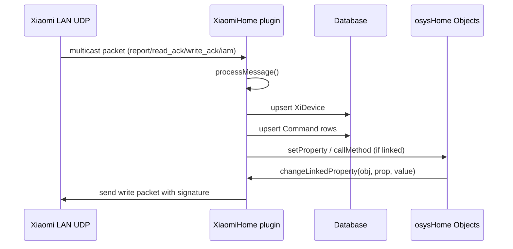
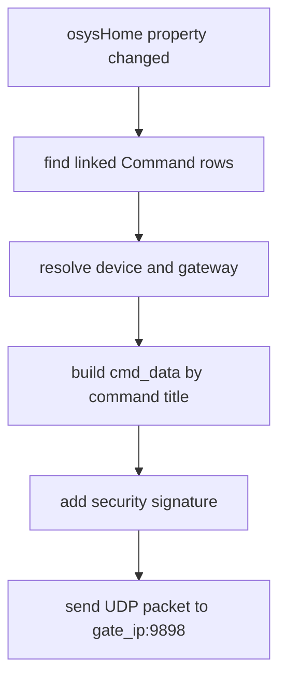

# XiaomiHome - Technical Reference

## Module Structure

Core files:

| File | Responsibility |
| --- | --- |
| `plugins/XiaomiHome/__init__.py` | Main lifecycle, UDP socket, message processing, object linking |
| `plugins/XiaomiHome/models/Device.py` | SQLAlchemy model `XiDevice` (`xidevices`) |
| `plugins/XiaomiHome/models/Command.py` | SQLAlchemy model `Command` (`xicommands`) |
| `plugins/XiaomiHome/templates/xiaomi_home.html` | Device list admin page |
| `plugins/XiaomiHome/templates/xiaomi_device.html` | Device editor (links and key) |
| `plugins/XiaomiHome/translations/*.json` | Basic i18n labels |

---

## Runtime Architecture

The plugin listens for Xiaomi LAN protocol multicast traffic and keeps an in-memory UDP socket with periodic health checks.



### Lifecycle flow

1. `initialization()` calls `xiaomi_socket_connect()`.
2. UDP socket binds to `0.0.0.0:9898` and joins multicast group `224.0.0.50`.
3. Plugin sends discovery packet `{"cmd":"whois"}`.
4. `cyclic_task()` receives packets with timeout handling.
5. If no data is received for `60` seconds, socket is recreated.

---

## Data Model

### `XiDevice` (`xidevices`)

| Field | Type | Meaning |
| --- | --- | --- |
| `id` | integer | Primary key |
| `title` | string | User-facing title |
| `type` | string | Xiaomi model (`gateway`, `magnet`, `sensor_ht`, ...) |
| `sid` | string | Xiaomi device SID |
| `gate_key` | string | Gateway LAN key (admin-set) |
| `gate_ip` | string | Last source IP for gateway |
| `token` | string | Token from gateway packets |
| `parent_id` | integer | Reserved/unused in current logic |
| `updated` | datetime | Last packet timestamp |

### `Command` (`xicommands`)

| Field | Type | Meaning |
| --- | --- | --- |
| `id` | integer | Primary key |
| `title` | string | Parsed parameter name (`temperature`, `motion`, `status`, ...) |
| `value` | string | Last value (stored as string) |
| `device_id` | integer | Parent `XiDevice` |
| `linked_object` | string | osysHome object name |
| `linked_property` | string | osysHome property name |
| `linked_method` | string | osysHome method name |
| `updated` | datetime | Last update timestamp |

---

## Network and Discovery

Socket settings in `xiaomi_socket_connect()`:

- protocol: `AF_INET` / `SOCK_DGRAM`
- bind: `0.0.0.0:9898`
- multicast group: `224.0.0.50`
- timeout: `1s`
- loopback enabled (`IP_MULTICAST_LOOP=1`)
- TTL: `32`

Discovery packet:

```json
{"cmd":"whois"}
```

When packet contains `sid`, plugin resolves device by `sid` and creates new row if missing.

---

## Message Processing Pipeline

`processMessage(message, ip)` performs:

1. Parse top-level JSON.
2. If `data` is stringified JSON, decode it.
3. Resolve/create `XiDevice`.
4. Update `token`, `gate_ip`, `updated`.
5. Build normalized `got_commands`.
6. Upsert `Command` rows by `(device_id, title)`.
7. Trigger linked property/method handlers.

### Command extraction highlights

| Input field / condition | Produced command(s) |
| --- | --- |
| `data.ip` | `ip` |
| `cmd in {write_ack, read_ack, report}` | command with raw payload JSON |
| gateway `report` + `rgb` | `rgb` (hex), `brightness` (high-byte) |
| `temperature` | `temperature = round(v/100, 2)` |
| `humidity` | `humidity = round(v/100, 2)` |
| `pressure` | `pressure_kpa`, `pressure_mm` |
| `status == motion` | `motion = 1` |
| `voltage` | `voltage`, `battery_level` |
| switch click status | `click0/click1/both_click/... = 1` |
| magnetic status | `status = 1/0` |

> [!NOTE]
> The command set is dynamic and may grow as new payload keys are observed.

---

## Link Execution Semantics

For each updated command row:

### Property path

If `linked_object` + `linked_property` is set:

```python
setProperty(f"{linked_object}.{linked_property}", value, self.name)
```

### Method path

If `linked_object` + `linked_method` is set, plugin calls:

```python
callMethod(f"{linked_object}.{linked_method}", message_data, self.name)
```

Method call suppression rule:

- call always for event-like commands (`motion`, `click0`, `click1`, `both_click`, `alarm`, `iam`, `leak`);
- call for specific device types (`sensor_switch.aq3`, `sensor_switch.aq2`, `switch`, `cube`);
- otherwise call only when value changed (`str(value) != old_value`).

---

## Control Path: Property -> Xiaomi Command

`changeLinkedProperty(obj, prop_name, value)` maps osysHome updates to Xiaomi `write` packets.



### Mapping rules

| Command title | Outgoing payload logic |
| --- | --- |
| `status` (plug types) | `status: on/off` |
| `channel_0` | `channel_0: on/off` |
| `channel_1` | `channel_1: on/off` |
| `curtain_level` | clamped `0..100`, string |
| `curtain_status` | allowed: `open`, `close`, `stop`, `auto` |
| `brightness` | combines with stored `rgb`, writes gateway `rgb` integer |
| `rgb` | strips `#`, combines optional brightness byte, writes gateway `rgb` integer |
| `ringtone` | `mid` and optional `vol`; `stop` -> `mid=10000` |

---

## Signature and Encryption Details

For `write` command to gateway-like devices, plugin computes:

```python
make_signature(token, key)
```

Algorithm:

- AES-CBC
- static IV: `17996d093d28ddb3ba695a2e6f58562e`
- plaintext: `token` (UTF-8)
- key: `gate_key` (UTF-8)
- output: lowercase hex ciphertext

The signature is placed into payload as:

- `data.key` for `gateway`
- `key` for `acpartner.v3`

> [!CAUTION]
> Invalid key length (AES requirement) or stale token will break write operations.

---

## HTTP Routes

Registered in plugin blueprint:

| Route | Method | Purpose |
| --- | --- | --- |
| `/XiaomiHome/device` | `POST` | Create/update device links |
| `/XiaomiHome/device/<device_id>` | `GET`, `POST` | Fetch device JSON / update same device |
| `/XiaomiHome/delete_cmnd/<cmd_id>` | `GET`, `POST` | Delete command row |

Admin UI page handler (`admin()`):

- `?op=edit&device=<id>` -> render `xiaomi_device.html`
- `?op=delete&device=<id>` -> delete device and commands
- default -> render `xiaomi_home.html`

All plugin routes use `@handle_admin_required`.

---

## Search Integration

`search(query)` scans command link fields:

- `linked_object`
- `linked_property`
- `linked_method`

Returns navigation items pointing to device editor:

```text
XiaomiHome?op=edit&device=<device_id>
```

---

## Known Caveats

> [!WARNING]
> `delCommand()` in `xiaomi_device.html` uses `this.device.command` instead of `this.device.commands`; local Vue array update is broken.

Other caveats:

- command update query expects existing row by `(device_id, title)`; malformed editor payload may fail;
- no explicit schema validation for inbound packets;
- values are stored as strings in DB, so type conversion is deferred to automation logic;
- module version remains `0.1` and translation set is minimal.

---

## Summary

`XiaomiHome` is a UDP-driven Xiaomi LAN integration layer with:

- automatic device/command discovery;
- dynamic parameter registry;
- object property and method linking;
- signed reverse control via gateway token/key.

See also:

- [User Guide](USER_GUIDE.md)
- [Module index](index.md)

