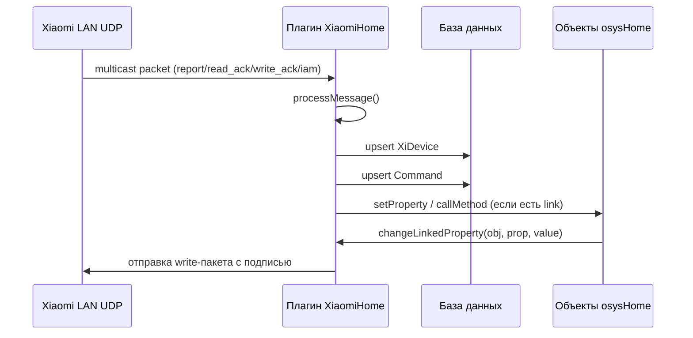
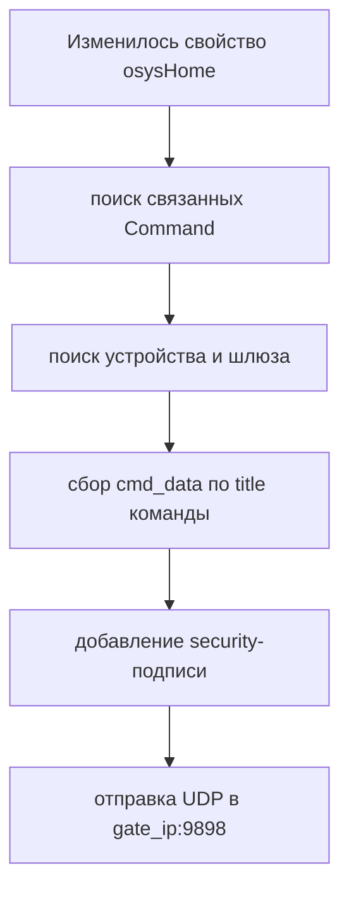

# XiaomiHome - Техническая документация

## Структура модуля

Ключевые файлы:

| Файл | Назначение |
| --- | --- |
| `plugins/XiaomiHome/__init__.py` | Жизненный цикл, UDP-сокет, обработка сообщений, связи с объектами |
| `plugins/XiaomiHome/models/Device.py` | SQLAlchemy-модель `XiDevice` (`xidevices`) |
| `plugins/XiaomiHome/models/Command.py` | SQLAlchemy-модель `Command` (`xicommands`) |
| `plugins/XiaomiHome/templates/xiaomi_home.html` | Страница списка устройств |
| `plugins/XiaomiHome/templates/xiaomi_device.html` | Редактор устройства (связи и ключ) |
| `plugins/XiaomiHome/translations/*.json` | Базовые переводы интерфейса |

---

## Архитектура выполнения

Модуль слушает multicast-трафик Xiaomi LAN protocol и поддерживает UDP-сокет с периодической проверкой активности.



### Поток жизненного цикла

1. `initialization()` вызывает `xiaomi_socket_connect()`.
2. UDP-сокет биндится к `0.0.0.0:9898` и вступает в multicast-группу `224.0.0.50`.
3. Модуль отправляет discovery-пакет `{"cmd":"whois"}`.
4. `cyclic_task()` принимает пакеты и обрабатывает таймауты.
5. При отсутствии данных `60` секунд сокет пересоздается.

---

## Модель данных

### `XiDevice` (`xidevices`)

| Поле | Тип | Смысл |
| --- | --- | --- |
| `id` | integer | Первичный ключ |
| `title` | string | Пользовательское имя устройства |
| `type` | string | Модель Xiaomi (`gateway`, `magnet`, `sensor_ht`, ...) |
| `sid` | string | Xiaomi SID устройства |
| `gate_key` | string | LAN-ключ шлюза (задается админом) |
| `gate_ip` | string | Последний IP шлюза-источника |
| `token` | string | Токен из пакетов шлюза |
| `parent_id` | integer | Резерв/не используется в текущей логике |
| `updated` | datetime | Время последнего входящего пакета |

### `Command` (`xicommands`)

| Поле | Тип | Смысл |
| --- | --- | --- |
| `id` | integer | Первичный ключ |
| `title` | string | Имя параметра (`temperature`, `motion`, `status`, ...) |
| `value` | string | Последнее значение (хранится строкой) |
| `device_id` | integer | Родительский `XiDevice` |
| `linked_object` | string | Имя объекта osysHome |
| `linked_property` | string | Имя свойства osysHome |
| `linked_method` | string | Имя метода osysHome |
| `updated` | datetime | Время последнего изменения |

---

## Сеть и обнаружение

Параметры сокета в `xiaomi_socket_connect()`:

- протокол: `AF_INET` / `SOCK_DGRAM`
- bind: `0.0.0.0:9898`
- multicast-группа: `224.0.0.50`
- timeout: `1s`
- loopback включен (`IP_MULTICAST_LOOP=1`)
- TTL: `32`

Discovery-пакет:

```json
{"cmd":"whois"}
```

Если в пакете есть `sid`, модуль ищет устройство по `sid` и создает запись при отсутствии.

---

## Пайплайн обработки сообщений

`processMessage(message, ip)` выполняет:

1. Парсинг верхнего JSON.
2. Если `data` приходит как строка JSON, дополнительный decode.
3. Поиск/создание `XiDevice`.
4. Обновление `token`, `gate_ip`, `updated`.
5. Формирование нормализованного списка `got_commands`.
6. Upsert записей `Command` по `(device_id, title)`.
7. Запуск связей на свойства/методы.

### Ключевые правила извлечения команд

| Входное условие | Создаваемые команды |
| --- | --- |
| `data.ip` | `ip` |
| `cmd in {write_ack, read_ack, report}` | команда с полным raw JSON |
| gateway `report` + `rgb` | `rgb` (hex), `brightness` (старший байт) |
| `temperature` | `temperature = round(v/100, 2)` |
| `humidity` | `humidity = round(v/100, 2)` |
| `pressure` | `pressure_kpa`, `pressure_mm` |
| `status == motion` | `motion = 1` |
| `voltage` | `voltage`, `battery_level` |
| click-статусы выключателей | `click0/click1/both_click/... = 1` |
| статус магнитного датчика | `status = 1/0` |

> [!NOTE]
> Набор команд динамический и может расширяться при появлении новых ключей в payload.

---

## Семантика выполнения связей

Для каждой обновленной записи команды:

### Путь в свойство

Если заполнены `linked_object` + `linked_property`:

```python
setProperty(f"{linked_object}.{linked_property}", value, self.name)
```

### Путь в метод

Если заполнены `linked_object` + `linked_method`, вызывается:

```python
callMethod(f"{linked_object}.{linked_method}", message_data, self.name)
```

Правило подавления вызовов метода:

- вызывать всегда для событийных команд (`motion`, `click0`, `click1`, `both_click`, `alarm`, `iam`, `leak`);
- вызывать всегда для типов устройств (`sensor_switch.aq3`, `sensor_switch.aq2`, `switch`, `cube`);
- иначе вызывать только при изменении значения (`str(value) != old_value`).

---

## Карта обратного управления: свойство -> команда Xiaomi

`changeLinkedProperty(obj, prop_name, value)` преобразует обновления osysHome в `write`-пакеты Xiaomi.



### Правила маппинга

| Название команды | Логика исходящего payload |
| --- | --- |
| `status` (типы розеток) | `status: on/off` |
| `channel_0` | `channel_0: on/off` |
| `channel_1` | `channel_1: on/off` |
| `curtain_level` | ограничение `0..100`, строка |
| `curtain_status` | только `open`, `close`, `stop`, `auto` |
| `brightness` | объединяется с текущим `rgb`, пишет gateway `rgb` integer |
| `rgb` | убирает `#`, при необходимости добавляет byte яркости |
| `ringtone` | `mid` и опционально `vol`; `stop` -> `mid=10000` |

---

## Подпись и шифрование

Для `write`-команд шлюза формируется:

```python
make_signature(token, key)
```

Алгоритм:

- AES-CBC
- статический IV: `17996d093d28ddb3ba695a2e6f58562e`
- plaintext: `token` (UTF-8)
- ключ: `gate_key` (UTF-8)
- результат: ciphertext в hex-строке нижнего регистра

Подпись кладется в payload как:

- `data.key` для `gateway`
- `key` для `acpartner.v3`

> [!CAUTION]
> Неверная длина ключа AES или устаревший token приводят к отказу на запись.

---

## HTTP-маршруты

Маршруты, зарегистрированные в blueprint:

| Маршрут | Метод | Назначение |
| --- | --- | --- |
| `/XiaomiHome/device` | `POST` | Создание/обновление связей устройства |
| `/XiaomiHome/device/<device_id>` | `GET`, `POST` | Получение JSON устройства / обновление |
| `/XiaomiHome/delete_cmnd/<cmd_id>` | `GET`, `POST` | Удаление записи команды |

Обработчик админки (`admin()`):

- `?op=edit&device=<id>` -> `xiaomi_device.html`
- `?op=delete&device=<id>` -> удаление устройства и команд
- по умолчанию -> `xiaomi_home.html`

Все маршруты защищены `@handle_admin_required`.

---

## Интеграция с поиском

`search(query)` ищет по полям:

- `linked_object`
- `linked_property`
- `linked_method`

Возвращает ссылки вида:

```text
XiaomiHome?op=edit&device=<device_id>
```

---

## Известные нюансы

> [!WARNING]
> В `xiaomi_device.html` метод `delCommand()` обращается к `this.device.command` вместо `this.device.commands`; локальное обновление массива в Vue работает некорректно.

Другие нюансы:

- обновление команд в POST ожидает существующую строку по `(device_id, title)`, некорректный payload может вызвать ошибку;
- входящие пакеты не проходят строгую schema-валидацию;
- значения хранятся строками, поэтому типизация переносится на уровень автоматизаций;
- версия модуля в коде `0.1`, набор переводов минимальный.

---

## Резюме

`XiaomiHome` это интеграционный слой Xiaomi LAN protocol с:

- автообнаружением устройств и параметров;
- динамическим реестром команд;
- диспетчеризацией связей в свойства/методы объектов;
- обратным управлением через подпись `token + gate_key`.

См. также:

- [Руководство пользователя](USER_GUIDE.ru.md)
- [Индекс модуля](index.ru.md)

